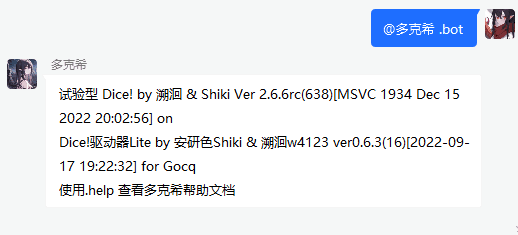
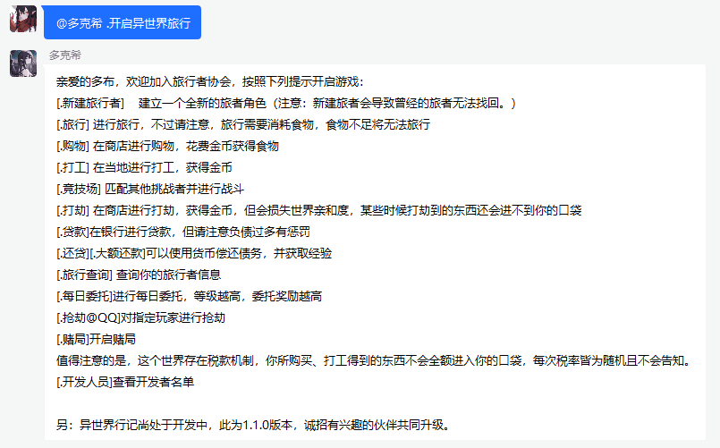
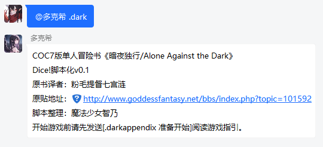
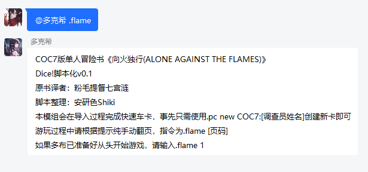
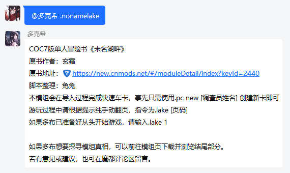
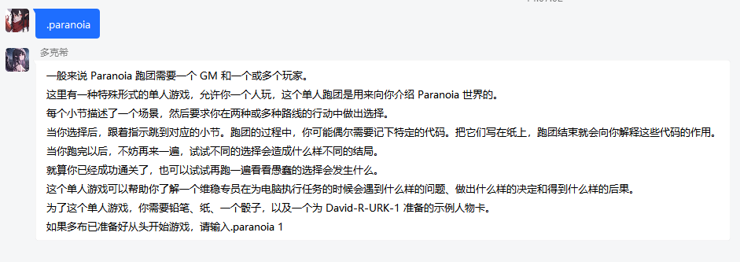
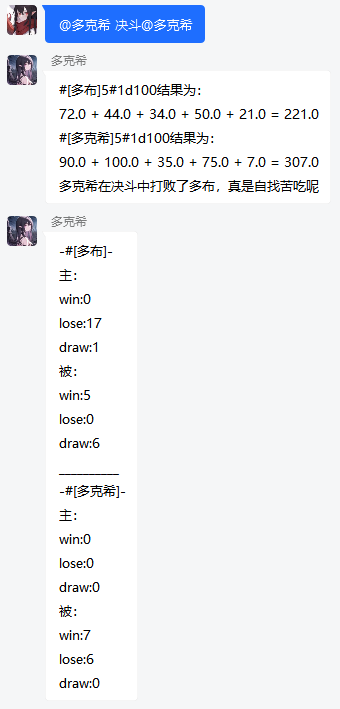
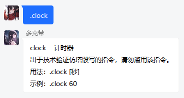
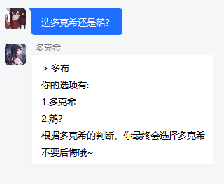

======
多克希
======

多克希介绍
=========

| 多克希是一只为跑团服务的可爱骰娘！人设是表面上像个小孩子，但实际上有着极为复杂的内心世界的小黑鸟，你永远也不可能知道她在想什么，她才是真正的幕后者！
| 你以为她什么也不懂？这只不过是你的幻想罢了

版本号
=====
| **(以.bot为主，没空，所以有空才会更新)**

功能
====

基本功能
-------

| 多克希主要为跑团服务
| 详见 `Shiki用户手册 <https://v2docs.kokona.tech/zh/latest/User_Manual.html>`__  

+-------+----------+---------+
|       | Disabled | Enabled |
+=======+==========+=========+
|  .me  |    √     |         |
+-------+----------+---------+
| .jrrp |          |    √    |
+-------+----------+---------+
| .deck |          |    √    |
+-------+----------+---------+
| .draw |          |    √    |
+-------+----------+---------+
| .send |          |    √    |
+-------+----------+---------+

娱乐功能
-------

| 多克希添加了一些娱乐功能，挺有趣的

异世界行记
^^^^^^^^^

| 用法在图里，是下载的插件，有报错的话发送 *.send+报错* 发过来
| （这当时只是想要看看这是啥功能的插件才装进去的，但是忘记删掉了，就留下来了，少玩这个）

暗夜独行/Alone Against the Dark
^^^^^^^^^^^^^^^^^^^^^^^^^^^^^^^

| 单人本

向火独行
^^^^^^^

未名湖畔
^^^^^^^

妄想症单人游玩
^^^^^^^^^^^^^

这个挺无聊的

.. warning::

   单人本需要高频发送指令，容易触发警告&被拉黑，所以请少用这个，并且尽量拉开每个指令的发送间隔！
   
翻译
^^^^

| 可以 *中译英*，*英译中*，但只限于这两种语言

原神\崩三tts语音
^^^^^^^^^^^^^^^

现支持人物
""""""""
   | 派蒙 , 空 , 荧 , 阿贝多 , 枫原万叶 , 温迪 , 八重神子 , 纳西妲 , 钟离 , 诺艾尔 , 凝光 , 托马 , 
   | 北斗 , 莫娜 , 荒泷一斗 , 提纳里 , 芭芭拉 , 艾尔海森 , 雷电将军 , 赛诺 , 琴 , 班尼特 , 五郎 , 
   | 神里绫华 , 迪希雅 , 夜兰 , 辛焱 , 安柏 , 宵宫 , 云堇 , 妮露 , 烟绯 , 鹿野院平藏 , 凯亚 , 达达利亚 , 
   | 迪卢克 , 可莉 , 早柚 , 香菱 , 重云 , 刻晴 , 久岐忍 , 珊瑚宫心海 , 迪奥娜 , 戴因斯雷布 , 魈 , 
   | 神里绫人 , 丽莎 , 优菈 , 凯瑟琳 , 雷泽 , 菲谢尔 , 九条裟罗 , 甘雨 , 行秋 , 胡桃 , 迪娜泽黛 , 
   | 柯莱 , 申鹤 , 砂糖 , 萍姥姥 , 奥兹 , 罗莎莉亚 , 式大将 , 哲平 , 坎蒂丝 , 托克 , 留云借风真君 , 
   | 昆钧 , 塞琉斯 , 多莉 , 大肉丸 , 莱依拉 , 散兵 , 拉赫曼 , 杜拉夫 , 阿守 , 玛乔丽 , 纳比尔 , 
   | 海芭夏 , 九条镰治 , 阿娜耶 , 阿晃 , 阿扎尔 , 七七 , 博士 , 白术 , 埃洛伊 , 大慈树王 , 女士
   | --- 原神
   | 丽塔 , 失落迷迭 , 缭乱星棘 , 伊甸 , 伏特加女孩 , 狂热蓝调 , 莉莉娅 , 萝莎莉娅 , 八重樱 , 八重霞 , 
   | 卡莲 , 第六夜想曲 , 卡萝尔 , 姬子 , 极地战刃 , 布洛妮娅 , 次生银翼 , 理之律者 , 迷城骇兔 , 希儿 , 
   | 魇夜星渊 , 黑希儿 , 帕朵菲莉丝 , 天元骑英 , 幽兰黛尔 , 德丽莎 , 月下初拥 , 朔夜观星 , 暮光骑士 , 
   | 明日香 , 李素裳 , 格蕾修 , 梅比乌斯 , 渡鸦 , 人之律者 , 爱莉希雅 , 爱衣 , 天穹游侠 , 琪亚娜 , 
   | 空之律者 , 薪炎之律者 , 云墨丹心 , 符华 , 识之律者 , 维尔薇 , 芽衣 , 雷之律者 , 阿波尼亚
   | --- 崩三（丽塔我老婆）
  
指令
""""
| ``说...`` 默认语音人物为神里绫华
| ``让...说...``  显而易见，不用再解释了吧？
  
.. note::
   这个功能很多时候用不了，不关多克希的事，请别责怪多克希，是API的问题

角色卡栏位扩展（状态、物品、笔记、法术、专长栏）
^^^^^^^^^^^^^^^^^^^^^^^^^^^^^^^^^^^^^^^^^^^

虽然主要是给DND的，但给COC也很好用

基本信息
"""""""

- 作者：安研色Shiki 

- 联系方式：官群928626681/1029435374；用户群708698754 

- 版本：v1.0 

- 发布日期：2022-7-6

- 简介：在pc角色卡中以表的形式读写状态栏、物品栏、法术栏、专长栏、笔记栏、装备栏（待更新）等。

详细介绍
""""""""

指令可参看PC_Slots.json中的帮助词条

状态栏
******

| 在角色卡中以_Status顺序记录添加的状态，同名堆叠，层数非负，为0则擦除
| ``状态-疯狂发作+疯狂潜伏``: 编辑状态，加减号可连用，+表示层数+1，-表示层数-1
| ``更新状态 精神正常=疯狂发作``: 替换状态名，继承原有层数
| ``查看状态/状态栏/当前状态``: 列出当前所有状态
| ``清除状态``: 清空状态栏

物品栏
******

| _Inventory字段与mod《PC_Inventory》冲突，请勿重复安装
| 在角色卡中以_Inventory无序记录加入的物品，同名堆叠，计数可以为负数或小数，为0则擦除
| ``物品+品名 * 计数-品名 * 计数``: 编辑物品计数，加减号可连用，*计数可省略（默认为1）
| ``放入物品/新增物品/添加物品/加入物品/放入背包``: 新增物品*计数
| ``删除物品/移出物品/移除物品/丢弃物品``: 将指定物品计数归零
| ``查看物品/物品栏/当前物品/查看背包``: 列出所有物品
| ``清空物品``: 清空物品栏

笔记栏
******

| 最初设计用作任务栏，后续拟将任务系统以桌而非玩家为单位，所以改称笔记(Journal)
| 在角色卡中以_Journal顺序记录添加带标题的笔记页，每页笔记，可以添加内容
| ``新建笔记 标题=内容``: 新建一页笔记并写下第一条内容
| ``更新笔记 标题=内容``: 在笔记页写下新一条内容
| ``查看笔记 标题``: 查看指定标题的笔记页
| ``删除笔记 标题``: 删除指定标题的笔记页
| ``笔记列表``: 列出每页笔记及最后一条
| ``清空笔记``: 删除所有笔记页

法术栏
******

| 在角色卡中以_Spells顺序记录添加的项目，同名不堆叠
| ``法术+/-``: 法术栏增/减项目 //+-号可连用
| ``查看法术/法术栏/法术列表``: 列出所有法术
| ``清空法术``: 清空法术栏

专长栏
******

| 在角色卡中以_Feats顺序记录添加的项目，同名不堆叠
| ``专长+/-``: 专长栏增/减项目 //+-号可连用
| ``查看专长/专长栏/专长列表``: 列出所有专长
| ``清空专长``: 清空专长栏

.. note::
   介绍来自 `角色卡栏位扩展（状态、物品、笔记、法术、专长栏） <https://forum.kokona.tech/d/1221-gong-neng-mo-kuai-jiao-se-qia-lan-wei-kuo-zhan-zhuang-tai-wu-pin-bi-ji-fa-zhu-zhuan-chang-lan>`__

Listen2me
^^^^^^^^^

使用MML作曲，懂的人可以来玩一玩

| 单轨示例
``l2m>A cdefgab``

| 双轨示例

``l2m>``
  | ``A l8d+>d+d+d+d4<a+4>cc<a+g+a+2d+>d+d+d+d4.<a+b+2g+4a+4d+>d+d+fd4<a+4>cl16d+f8.d+<a+4.&a+gfl8d+``
  | ``>d+d+gfd+dl16<a+>d+4.&d+cdd+8dd+8.<a+8>fgf2gg8.fd+f8cd+4&d+<a+8>gg8.fd+f8d+<a+4.&a+>gg8.fd+f8cd+4d+``
  | ``d+8dd8.cc8.<a+a+8.>cd+g+8.g8.fd+f8cd+4&d+<a+8>dd8d+8f<a+8ga+8>f8d+d+8.<a+a+8g+gg+8>d+d+2<a+a+8g+gg+8>ff4.&fd+8d+8df8d+2.``
  | ``B``
  | ``/*M 0  */  <c8g8>d+4<<g8>d8a+4/*M 1  */  <g+8>d+8<a+4>d+4d4/*M 2  */  c8g8>d+4<<g8>d8a+4/*M 3  */  <g+8>d+8>c8<d+8<g+8>d+8<a+8b8/*M 4  */  >c8g8>d+8<g8<g8>d8a+8d8/*M 5  */  <g+8>d+8<a+4>d+8a+8d4/*M 6  */  c8g8>d+8<g8<g8>d8a+8d8/*M 7  */  <g+8>d+8>c8.<<a+16b4g+4/*M 8  */  a+8>f8a+4<<a+2/*M 9  */  >g+8>d+8>c8<d+8<g+8>d8a+8d8/*M 10 */  <g8>d+8a+8d+8c8g8>d8d+8/*M 11 */  <<f8>g8>d+8<g+8<a+8>f8>d8<a+8/*M 12 */  <d+8a+8>d+8<a+8>c+8<a+8>c+8<<a+8/*M 13 */  >g+8>d+8>c8<d+8<g+8>d8a+8d8/*M 14 */  <g8>d8.<g8.>c4<d8d+8/*M 15 */  f8>c8g+8c8<g8>d+8a+8d+8/*M 16 */  <g+8>d+8>c8<d+16.<<a+32o4d2/*M 17 */  <<d+16a+16>g16g+16a+8.<d+4.&d+16d+8``
.. note::
   原贴：  `listen2me: mml作曲 <https://forum.kokona.tech/d/1496-gong-neng-mo-kuai-yu-le-xiang-listen2me-mmlzuo-qu>`__
  

决斗
^^^^
很简单

每日新闻60s
^^^^^^^^^^^

| 每日新闻小简报

| 使用《署名—非商业性使用—相同方式共享 4.0 协议国际版》（CC BY-NC-SA 4.0）进行授权
| https://creativecommons.org/licenses/by-nc-sa/4.0/legalcode.zh-Hans

| 作者：简律纯
| 联系方式：qq:A2C29K9
| 版本：2.0.2
| 更新日期：2022/7/27
| 关键词： ``60s`` ``订阅新闻`` ``退订新闻``

| 简介：既然有60s插件，那么，为什么不能有60s脚本实现同样功能呢？

| 许可协议：CC BY-NC-SA 4.0

| ``60s``：发送今日60s
| ``订阅新闻``：每日七点半准时自动推送
| ``退订新闻``： 显而易见

.. note::
   原贴：  `每日新闻60s <https://forum.kokona.tech/d/1107-zhi-ling-jiao-ben-mei-ri-xin-wen-60s>`__

计时器clock
^^^^^^^^^^^

指令：``.clock+秒`` **（加号不用写出）**

选择困难症
^^^^^^^^^

| 我该选什么？

| ......

趣味包
^^^^^^

爬，丢，赞，啃，舔，跑，cpdd，比心，牵，鄙视，你可能需要，吃，拍，锤，马冬梅
后面加艾特，我这边就不一一试了

漂流瓶
^^^^^^

漂流瓶有挺多指令和指令限制

``扔漂流瓶`` 这要怎么扔是常识

``捡漂流瓶`` 同上

``下水查看`` 查看目前群、个人、总剩余漂流瓶数

``查询漂流瓶`` 分为qq号查询和id查询

``查询漂流瓶[艾特]\[qq号]`` 按QQ号查询，**需要4级信任以上、群管、查自己的才行**

``查询漂流瓶#[id]`` 按id查询，任何人都行，id就是数字（这个漂流瓶排在第几位）

``下水回收`` 删除漂流瓶，同上

``清空漂流瓶`` 这个只有25以上信任和骰主才能操作

``关闭漂流瓶`` 仅25级以上信任和群管能用，关闭本群漂流瓶

``开启漂流瓶`` 同上

``漂流瓶全局关闭``仅25级以上信任和骰主能用，关闭全局的漂流瓶功能

``漂流瓶全局开启`` 仅25级以上信任和骰主能用

.. note::
   这个是原创，由于能力不足，可能有挺多bug，如有看到*.send+报错指令*，谢谢
   
bilibili查询
^^^^^^^^^^^^

触发方式很多，你们可以自己尝试，我这边就放两种

.. image:: _static/Image_12.png
